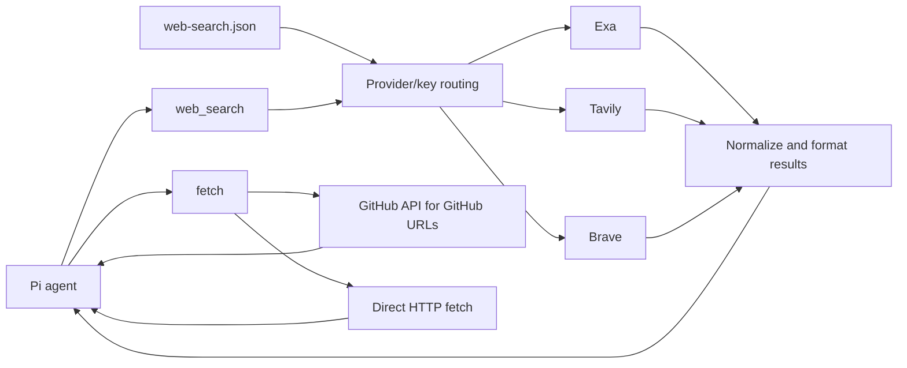

# pi-search-control

Lightweight web access package for Pi. It registers only two tools:

- `web_search` — search with Exa, Tavily, and Brave Search
- `fetch` — fetch URL content directly

No curator UI, no browser cookie access, no Gemini/Perplexity, no video analysis, no background servers, no storage cache, and no package runtime dependencies.

## Architecture



`balanced` mode shuffles every provider/key pair in one pool. `auto` preserves provider priority while rotating keys inside each provider. Failed targets fall through to the next target in the generated plan.

## Configuration

`pi-search-control` reads **only** the new format at `~/.pi/web-search.json`:

```json
{
  "provider": "balanced",
  "providers": ["exa", "tavily", "brave"],
  "apiKeys": {
    "exa": ["exa-key-1"],
    "tavily": ["tavily-key-1", "tavily-key-2"],
    "brave": ["brave-key-1", "brave-key-2"]
  },
  "search": {
    "numResults": 5,
    "timeoutMs": 20000
  },
  "fetch": {
    "timeoutMs": 20000,
    "maxChars": 30000
  }
}
```

Legacy fields are intentionally rejected:

- `exaApiKey`, `exaApiKeys`
- `tavilyApiKey`, `tavilyApiKeys`
- `braveApiKey`, `braveApiKeys`
- `loadBalancing`, `workflow`, `geminiApiKey`, `perplexityApiKey`

## Provider modes

### `balanced`

Flattens every provider+key pair into one pool and shuffles it per search.

Example:

```json
{
  "provider": "balanced",
  "providers": ["exa", "tavily", "brave"],
  "apiKeys": {
    "exa": ["exa1"],
    "tavily": ["tvly1", "tvly2"],
    "brave": ["brave1", "brave2"]
  }
}
```

Targets:

```text
exa:exa1
tavily:tvly1
tavily:tvly2
brave:brave1
brave:brave2
```

Each target has equal probability.

### `auto`

Uses `providers` as the priority order. Keys within the same provider are shuffled.

```json
{
  "provider": "auto",
  "providers": ["tavily", "exa", "brave"]
}
```

This tries all Tavily keys first, then Exa keys, then Brave keys.

### Direct provider

```json
{ "provider": "brave" }
```

Only Brave keys are used. No fallback to other providers.

## Tools

### `web_search`

```json
{
  "query": "React 19 compiler pitfalls"
}
```

or:

```json
{
  "queries": [
    "React 19 compiler performance",
    "React 19 compiler migration pitfalls"
  ]
}
```

Provider, key, and result count are chosen by config only. The result includes a hashed `keyId` such as `tavily#12ab34cd` so you can verify balancing without leaking API keys.

### `fetch`

```json
{
  "url": "https://github.com/GATE"
}
```

or:

```json
{
  "urls": ["https://example.com", "https://github.com/owner/repo"]
}
```

`fetch` is plain fetch: no prompt, no AI analysis.

GitHub URLs use the GitHub API for stable extraction:

- `https://github.com/org` — organization/user repositories
- `https://github.com/org/repo` — repo metadata + README
- `https://github.com/org/repo/blob/ref/path` — raw file content

## Install

Install from npm:

```bash
pi install npm:pi-search-control
```

Local development:

```bash
pi -e ./src/index.ts
```

Disable/remove the old `pi-web-lite` package first if both register `web_search`.

## Provenance

`pi-search-control` is an attributed MIT-licensed fork of [`pi-web-lite`](https://github.com/smithyyang/pi-web-lite) (kept as the `upstream` git remote). See [ADR 0001](./docs/adr/0001-fork-pi-web-lite-for-provider-adapters.md).

## License

MIT — see [LICENSE](./LICENSE).