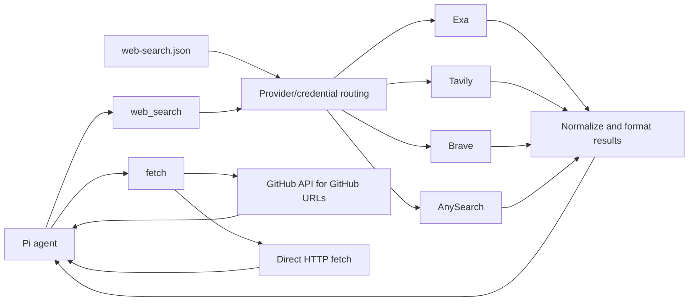

# pi-search-control

Lightweight web access package for Pi. It registers only two tools:

- `web_search` — search with Exa, Tavily, Brave Search, and AnySearch
- `fetch` — fetch URL content directly

No curator UI, no browser cookie access, no Gemini/Perplexity, no video analysis, no background servers, no storage cache, and no package runtime dependencies.

## Features

- **Search Profiles** — named, session-scoped provider policies; switch with `/search-profile`, restored per session branch
- **Provider Pins** — `/search-provider <provider>` pins one provider for the session branch; `/search-provider reset` restores profile routing
- **Status panel** — `/search-status` opens an interactive TUI panel (TUI mode) with per-provider pages: cooldowns, thresholds, allowance estimates, attempt/success/failure counts
- **Validate-then-swap reload** — `/search-reload` applies config changes only after validation
- **Credential hygiene** — env-backed keys only, aliases in all user-visible output, error bodies treated as sensitive
- **Thresholds & allowances** — per-period attempt thresholds demote credentials; allowances estimate remaining usage (AnySearch ships a 1,000/day provider default)
- **Profile guidance** — optional per-profile `guidance` string appended after the non-replaceable built-in policy guidance

## Architecture



A Search Profile names an ordered list of providers. The `web_search` tool follows the active profile's provider order; failed targets fall through to the next target in the generated plan.
## Configuration

`pi-search-control` reads **only** the new format at `~/.pi/web-search.json`:

```json
{
  "defaultProfile": "research",
  "profiles": {
    "research": { "providers": ["exa", "tavily", "brave"] },
    "economy": { "providers": ["brave", "tavily"] }
  },
  "credentials": {
    "exa": [{ "alias": "exa-main", "env": "EXA_API_KEY" }],
    "tavily": [
      { "alias": "tvly-work", "env": "TAVILY_API_KEY_WORK" },
      { "alias": "tvly-personal", "env": "TAVILY_API_KEY" }
    ],
    "brave": [{ "alias": "brave-main", "env": "BRAVE_API_KEY" }],
    "anysearch": [{ "alias": "any-main", "env": "ANYSEARCH_API_KEY" }]
  },
  "search": {
    "numResults": 5,
    "timeoutMs": 20000
  },
  "fetch": {
    "timeoutMs": 20000,
    "maxChars": 30000
  }
}
```

`defaultProfile` is required and must name a key in `profiles`. Every profile must declare a non-empty `providers` array of `exa`, `tavily`, `brave`, or `anysearch`. Every credential declares a globally unique `alias` and the `env` variable that carries the key at runtime; no raw key is ever written to the config file. A declared but unset environment variable only makes that credential unavailable, which degrades its provider rather than failing the load. User-visible output names credentials by alias only, never by key content or environment-variable name.

Without a Provider Pin, AnySearch is eligible only when it appears in a profile's `providers` array; declaring an AnySearch credential does not route to it by itself. The AnySearch adapter calls the authenticated `POST https://api.anysearch.com/v1/search` endpoint with Bearer auth, sends only the query and a result count clamped to 1–10, and preserves AnySearch-only fields (`content`, `request_id`, `total_results`, `search_time_ms`) as namespaced provider extensions rather than in model-visible text. This increment integrates the REST endpoint only: the AnySearch MCP transport, the anonymous tier, the HTTP 402 auto-registration flow, and the `tag`/`zone`/`language`/`params` capability controls are all out of scope. AnySearch performs automatic capability routing.

AnySearch treats an HTTP 402 as quota exhaustion: the attempt is recorded with category `quota`, the credential enters a five-minute Credential Cooldown, and the same Search Request falls through to the next usable route. Every AnySearch error body is treated as sensitive (a 402 body can carry generated credentials), so only an allowlisted HTTP status, error category, and request ID survive into errors, tool details, logs, the Usage Ledger, or user-facing diagnostics; raw response-body text is discarded immediately.

A profile may also declare an optional `guidance` string. It is appended after the non-replaceable built-in safety, privacy, and policy guidance, so it can add to the model's instructions but cannot replace or weaken the built-in rules. Switching profiles changes the injected guidance for the session.

A credential may declare an optional `threshold` (a per-period Provider Attempt count that demotes it in routing and warns by alias) and an optional `allowance` (`{ "units": 500, "period": { "kind": "calendar-month" } }`) used only to estimate remaining usage. An allowance never affects routing and is distinct from a threshold. AnySearch supplies a built-in provider-default allowance of 1,000 requests per calendar day; a credential-level allowance overrides it for that credential only.

AnySearch's public Free plan publishes 1,000 requests per calendar day, so that figure is the built-in provider default. A separately granted 2,000-request developer allowance has an unknown reset period and must **not** be configured as an allowance until that reset period is known; do not replace the provider default globally with it. Allowances and thresholds are local estimates, never provider-authoritative balances.

Legacy fields are intentionally rejected, including the old `apiKeys` structure (use `credentials` instead):

- `provider`, `providers`, `apiKeys`
- `exaApiKey`, `exaApiKeys`
- `tavilyApiKey`, `tavilyApiKeys`
- `braveApiKey`, `braveApiKeys`
- `loadBalancing`, `workflow`, `geminiApiKey`, `perplexityApiKey`

## Search Profiles

A Search Profile is a named, session-scoped policy. Its `providers` array is the order in which providers are tried:

```json
{
  "defaultProfile": "research",
  "profiles": {
    "research": { "providers": ["exa", "tavily", "brave"] },
    "economy": { "providers": ["brave", "tavily"] }
  }
}
```

The `research` profile builds this target order (one target per available credential, in declared credential order):

```text
exa:exa-main
tavily:tvly-work
tavily:tvly-personal
brave:brave-main
```

Adding `anysearch` to a profile appends an `anysearch:<alias>` target for each available AnySearch credential.

New sessions start with `defaultProfile`. Use `/search-profile <name>` to switch the profile for the current session; with no argument in TUI mode it opens a selector. Resuming or navigating a session branch restores the profile selected on that branch.

## Provider Pins

Use `/search-provider <provider>` to temporarily pin the current session branch to one Search Provider, including a configured provider outside the active Search Profile:

```text
/search-provider anysearch
```

A Provider Pin narrows the effective route to that provider only. Credentials within the provider can still rotate, but a failed attempt never falls back to another provider. The Provider must have at least one credential declaration; availability of its environment-backed credential is reported separately.

In TUI mode, `/search-provider` with no argument opens a selector containing every provider with a declared credential plus `reset`. Command argument completion offers the same provider names. Use `/search-provider reset` to restore the active Search Profile's routing. Selecting a profile with `/search-profile` also clears the pin.

Provider Pins are recorded on the session branch and restored when that branch is resumed or selected. `/search-reload` automatically resets the pin with a warning if the provider no longer has a declared credential. The model cannot set a Provider Pin through `web_search`.

## Status

`/search-status` shows one shared snapshot in two host-dependent ways:

- In **TUI mode** it opens a temporary interactive Search Status Panel instead of printing a long report. Pages appear in the fixed order Overview, Exa, Tavily, Brave, AnySearch. Right arrow or Tab selects the next page; left arrow or Shift+Tab selects the previous page, and navigation wraps. Escape or `q` closes the panel, which appends no transcript or session entry. Overview shows the active profile, any Provider Pin, the effective provider order, current-session/daily/monthly Search Request and Provider Attempt totals, overall success/failure counts, and global warnings. Each provider page shows effective-route membership, credential availability, active cooldowns and their safe cause, thresholds, Credential Allowance Estimates, per-period success/failure counts, and estimated consumption.
- In **RPC mode** it emits a non-interactive notification built from the same snapshot.

Pi does not execute interactive extension commands through print/JSON prompts, and their UI notifications are not observable, so `/search-status` performs no UI operation in print or JSON modes and does not promise output there. The panel is a snapshot captured at open time; it does not live-refresh.

When the effective route has no eligible credential, the panel marks it **No usable route** before any search is attempted. Without a Provider Pin, a Search Provider configured outside the active profile is never an implicit fallback. With a Provider Pin, only the pinned provider belongs to the effective route.

## Tools

### `web_search`

```json
{
  "query": "React 19 compiler pitfalls"
}
```

or:

```json
{
  "queries": [
    "React 19 compiler performance",
    "React 19 compiler migration pitfalls"
  ]
}
```

Provider, credential, and result count are chosen by config only. The result names the credential by its configured `alias` so you can verify balancing without leaking API keys.

### `fetch`

```json
{
  "url": "https://github.com/GATE"
}
```

or:

```json
{
  "urls": ["https://example.com", "https://github.com/owner/repo"]
}
```

`fetch` is plain fetch: no prompt, no AI analysis.

GitHub URLs use the GitHub API for stable extraction:

- `https://github.com/org` — organization/user repositories
- `https://github.com/org/repo` — repo metadata + README
- `https://github.com/org/repo/blob/ref/path` — raw file content

## Install

Install from npm:

```bash
pi install npm:pi-search-control
```

Local development:

```bash
pi -e ./src/index.ts
```

Disable/remove the old `pi-web-lite` package first if both register `web_search`.

## Provenance

`pi-search-control` is an attributed MIT-licensed fork of [`pi-web-lite`](https://github.com/smithyyang/pi-web-lite) (kept as the `upstream` git remote). See [ADR 0001](./docs/adr/0001-fork-pi-web-lite-for-provider-adapters.md).

## License

MIT — see [LICENSE](./LICENSE).