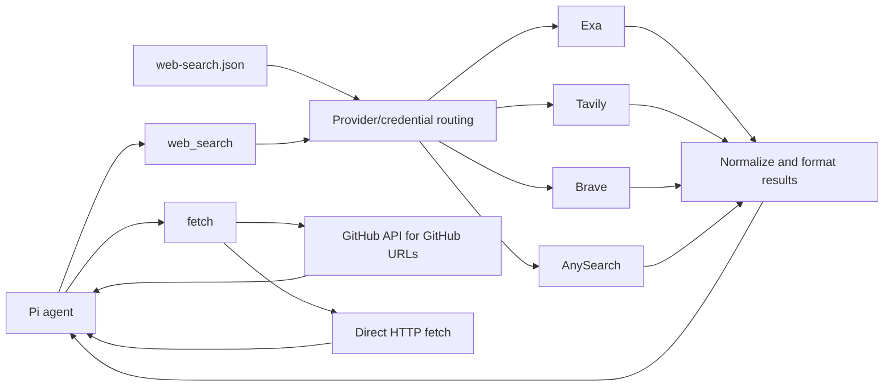

# pi-search-control

Lightweight web access package for Pi. It registers only two tools:

- `web_search` — search with Exa, Tavily, Brave Search, and AnySearch
- `fetch` — fetch URL content directly

No curator UI, no browser cookie access, no Gemini/Perplexity, no video analysis, no background servers, no storage cache, and no package runtime dependencies.

## Architecture



A Search Profile names an ordered list of providers. The `web_search` tool follows the active profile's provider order; failed targets fall through to the next target in the generated plan.
## Configuration

`pi-search-control` reads **only** the new format at `~/.pi/web-search.json`:

```json
{
  "defaultProfile": "research",
  "profiles": {
    "research": { "providers": ["exa", "tavily", "brave"] },
    "economy": { "providers": ["brave", "tavily"] }
  },
  "credentials": {
    "exa": [{ "alias": "exa-main", "env": "EXA_API_KEY" }],
    "tavily": [
      { "alias": "tvly-work", "env": "TAVILY_API_KEY_WORK" },
      { "alias": "tvly-personal", "env": "TAVILY_API_KEY" }
    ],
    "brave": [{ "alias": "brave-main", "env": "BRAVE_API_KEY" }],
    "anysearch": [{ "alias": "any-main", "env": "ANYSEARCH_API_KEY" }]
  },
  "search": {
    "numResults": 5,
    "timeoutMs": 20000
  },
  "fetch": {
    "timeoutMs": 20000,
    "maxChars": 30000
  }
}
```

`defaultProfile` is required and must name a key in `profiles`. Every profile must declare a non-empty `providers` array of `exa`, `tavily`, `brave`, or `anysearch`. Every credential declares a globally unique `alias` and the `env` variable that carries the key at runtime; no raw key is ever written to the config file. A declared but unset environment variable only makes that credential unavailable, which degrades its provider rather than failing the load. User-visible output names credentials by alias only, never by key content or environment-variable name.

AnySearch is eligible only when it appears in a profile's `providers` array; declaring an AnySearch credential does not route to it by itself. The AnySearch adapter calls the authenticated `POST https://api.anysearch.com/v1/search` endpoint with Bearer auth, sends only the query and a result count clamped to 1–10, and preserves AnySearch-only fields (`content`, `request_id`, `total_results`, `search_time_ms`) as namespaced provider extensions rather than in model-visible text.

A profile may also declare an optional `guidance` string. It is appended after the non-replaceable built-in safety, privacy, and policy guidance, so it can add to the model's instructions but cannot replace or weaken the built-in rules. Switching profiles changes the injected guidance for the session.

A credential may declare an optional `threshold` (a per-period Provider Attempt count that demotes it in routing and warns by alias) and an optional `allowance` (`{ "units": 2000, "period": { "kind": "calendar-month" } }`) used only to estimate remaining usage. An allowance never affects routing and is distinct from a threshold. AnySearch supplies a built-in provider-default allowance of 1,000 requests per calendar day; a credential-level allowance overrides it.

Legacy fields are intentionally rejected, including the old `apiKeys` structure (use `credentials` instead):

- `provider`, `providers`, `apiKeys`
- `exaApiKey`, `exaApiKeys`
- `tavilyApiKey`, `tavilyApiKeys`
- `braveApiKey`, `braveApiKeys`
- `loadBalancing`, `workflow`, `geminiApiKey`, `perplexityApiKey`

## Search Profiles

A Search Profile is a named, session-scoped policy. Its `providers` array is the order in which providers are tried:

```json
{
  "defaultProfile": "research",
  "profiles": {
    "research": { "providers": ["exa", "tavily", "brave"] },
    "economy": { "providers": ["brave", "tavily"] }
  }
}
```

The `research` profile builds this target order (one target per available credential, in declared credential order):

```text
exa:exa-main
tavily:tvly-work
tavily:tvly-personal
brave:brave-main
```

Adding `anysearch` to a profile appends an `anysearch:<alias>` target for each available AnySearch credential.

New sessions start with `defaultProfile`. Use `/search-profile <name>` to switch the profile for the current session; with no argument in TUI mode it opens a selector. Resuming or navigating a session branch restores the profile selected on that branch.

## Tools

### `web_search`

```json
{
  "query": "React 19 compiler pitfalls"
}
```

or:

```json
{
  "queries": [
    "React 19 compiler performance",
    "React 19 compiler migration pitfalls"
  ]
}
```

Provider, credential, and result count are chosen by config only. The result names the credential by its configured `alias` so you can verify balancing without leaking API keys.

### `fetch`

```json
{
  "url": "https://github.com/GATE"
}
```

or:

```json
{
  "urls": ["https://example.com", "https://github.com/owner/repo"]
}
```

`fetch` is plain fetch: no prompt, no AI analysis.

GitHub URLs use the GitHub API for stable extraction:

- `https://github.com/org` — organization/user repositories
- `https://github.com/org/repo` — repo metadata + README
- `https://github.com/org/repo/blob/ref/path` — raw file content

## Install

Install from npm:

```bash
pi install npm:pi-search-control
```

Local development:

```bash
pi -e ./src/index.ts
```

Disable/remove the old `pi-web-lite` package first if both register `web_search`.

## Provenance

`pi-search-control` is an attributed MIT-licensed fork of [`pi-web-lite`](https://github.com/smithyyang/pi-web-lite) (kept as the `upstream` git remote). See [ADR 0001](./docs/adr/0001-fork-pi-web-lite-for-provider-adapters.md).

## License

MIT — see [LICENSE](./LICENSE).